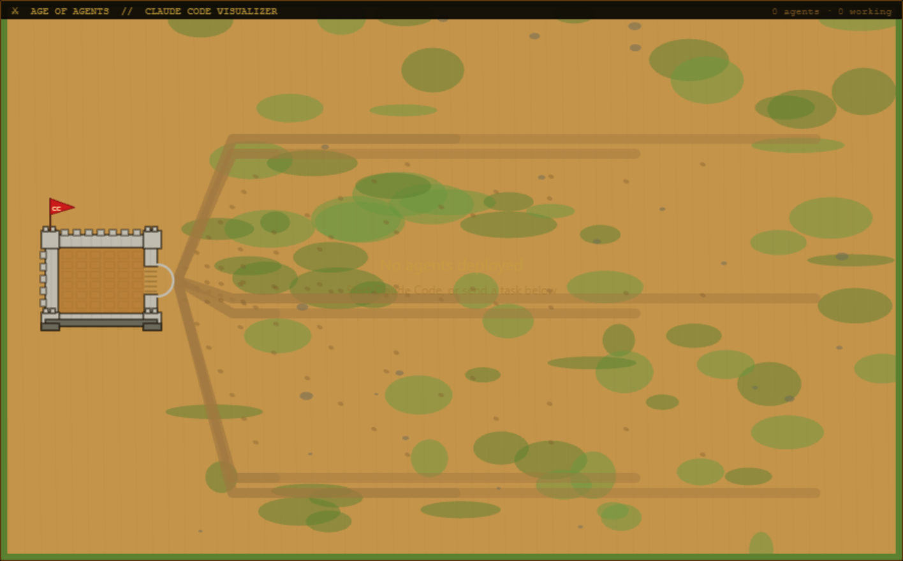
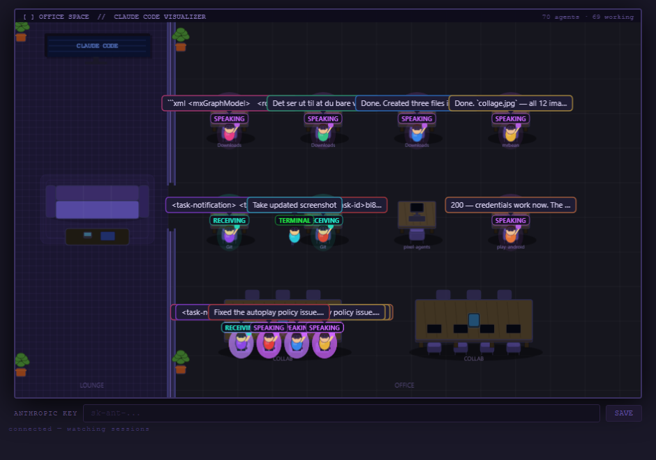

# Claude Code Agent Visualizer: Pixel Agents

A real-time visualizer that renders active [Claude Code](https://claude.ai/code) sessions as animated characters working in different environments. Each agent appears as a character that walks to its workspace, raises tools matching its current action (reading, writing, terminal, browsing, thinking, spawning sub-agents, etc.), and shows speech bubbles with task details.

## How to start

Requires Node.js. No dependencies — runs on the standard library.

```bash
node server.js
```

Open **http://localhost:3334** in your browser.

The server watches `~/.claude/projects/` for active Claude Code session logs and streams events to the browser via SSE.

## Branches / visual styles

Switch branches and reload to change the look.

| Branch | Style | Preview |
|--------|-------|---------|
| `age-of-agents` | Medieval Age of Empires 4 — workers build structures in a walled settlement |  |
| `office-space` | Modern office — agents work at individual desks or gather at collab tables, idle on the couch |  |

## Configuration

Copy `config.example.js` to `config.js` and update for your setup:

```bash
cp config.example.js config.js
```

**`BASE_DIR`** — absolute path to your projects root (e.g. `/home/you/projects`).

**`DIR_PREFIX`** — how Claude encodes that path as a session directory name. Claude replaces path separators with dashes, so `/home/you/projects` becomes `home-you-projects` and `C:\Tormod\Git` becomes `C--Tormod-Git`.

**`PROJECT_MAP`** — display names for the Deploy dropdown, mapping label → project directory name.

`config.js` is gitignored so your local paths are never committed.

## Features

- Agents walk from a resting area to individual workspaces when they become active
- Collab table / group building: sub-agents spawned from the same project gather at a shared workspace
- Worker tools and glow colors change based on current action
- Speech bubbles show the current task detail
- Idle agents return to the resting area after ~50 seconds of inactivity
- Deploy panel (hidden by default) lets you send prompts directly to Claude Code
